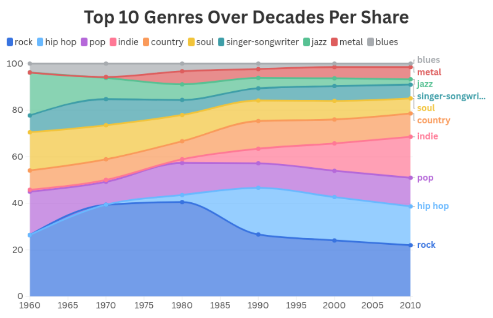
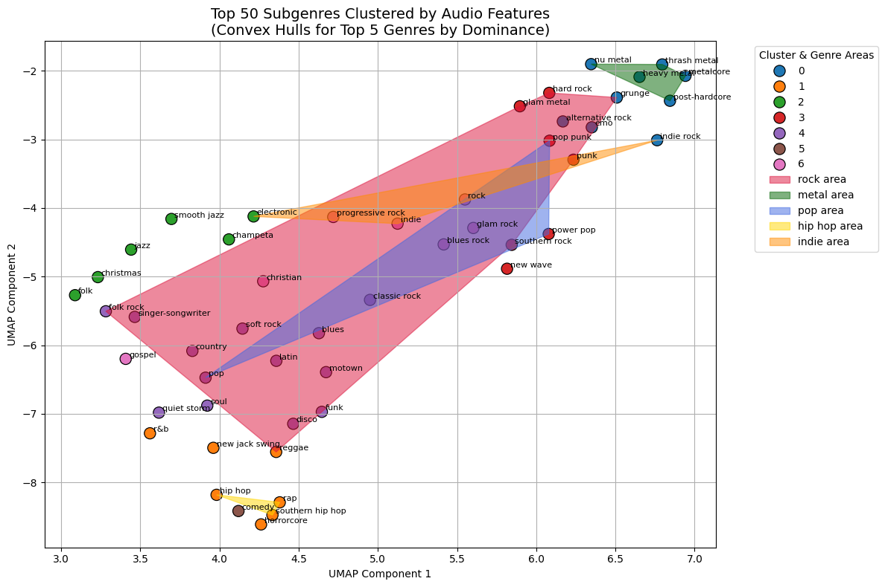

# 🎧 OK Computer, Map My Sound  
*A Decade-Spanning Analysis of Genres, Artists, and Audio Features*

> 📍 Capstone project for the Data Science Diploma at the German University in Cairo (GUC)  
> 📆 1963–2019 | 🎼 Billboard x Spotify x LastFM  
> 👨‍💻 By: Nadeen Emadeldin, Tarek Gado, Menna Abdelrazek, Kareem Metwally, Ziad Darwish  
> 🎓 Supervised by: Assoc. Prof. Dr. Mervat AbuElkheir  

---

## 🎯 Project Overview

Music is more than sound—it’s a cultural mirror. This project analyzes six decades of U.S. Billboard Top 200 data, enriched with Spotify and LastFM metadata, to explore how music evolved in terms of genres, acoustic features, and artist trends.

---

## ❓ Research Questions

### 🎵 Music Genre
- What are the top genres of all time?
- Which genres expanded, faded, or fractured over decades?
- How are subgenres interlinked with main genres?
 
 

### 🎶 Acoustic Features
- How do energy, danceability, valence, etc. vary across genres and time?
- Are genres becoming louder, happier, or more electronic?
- Can we cluster subgenres based on acoustic similarities?

### 👥 Artists
- Who are the top artists per genre and decade?
- How does gender representation evolve across genres?
- Which artists remained “timeless” across decades?

---

## 🛠️ Data Engineering Pipeline

- **Extraction**: Billboard dataset + Spotify & LastFM APIs  
- **Transformation**: Cleaning, genre mapping, normalization, scaling  
- **Loading**: PostgreSQL (pgAdmin), automated via Apache Airflow  

---

## 📊 Key Features

- ~292K tracks after filtering  
- Acoustic features: energy, valence, danceability, loudness, etc.  
- Metadata: genre, subgenre, artist gender, release date  
- Clustering using KMeans + UMAP for genre similarity mapping  
- Gender trends per genre/decade  

---

## 🔍 Clustering & Style Mapping

We explored clustering techniques to visually map the **proximity of music subgenres** based on their average acoustic features such as energy, valence, and danceability.  

We tested:
- **K-Means**
- **Agglomerative Clustering**
- **DBSCAN**

Among them, **K-Means + UMAP** gave the clearest and most coherent clusters.  
- UMAP helped preserve both **local and global structure**, outperforming PCA and t-SNE in separation clarity.  
- We used **convex hulls** to highlight dominant genre groups in the acoustic space.  

Key observations:

- Some subgenres with distinct sound profiles still grouped under the same genre.
- This indicates that genre labels often reflect **cultural or historical context** beyond just audio similarity.

This visualization helped us interpret genre boundaries and sonic proximity in a tangible and intuitive way.

---

## 📈 Interactive Visualizations

Explore the dashboard here:  
🔗 [https://public.flourish.studio/story/3211471/](https://public.flourish.studio/story/3211471/)

Includes:
- Genre trends over time  
- Audio profiles of top genres  
- Chord diagrams for genre-subgenre overlap  
- Subgenre clustering maps  
- Top artists by genre and gender  
- Artist longevity analysis  

---

## 💡 Key Insights

- **Rock** dominated early decades; **Hip Hop** surged post-90s  
- Modern music trends show higher **energy**, **danceability**, and **loudness**  
- Subgenres often share features across multiple main genres  
- **Male artists dominate** most genres, with **pop** as the exception  
- “Timeless” artists like **Elvis** and **Bob Dylan** stay relevant via reissues  

---

## ⚠️ Limitations

- Dataset is U.S.-centric (Billboard only)  
- Genre labeling is inconsistent between APIs  
- Spotify audio feature API is deprecated  
- Post-2019 data not included  

---

## 🚀 Future Work

- Add **lyrics** for sentiment analysis  
- Extend dataset with post-2019 music  
- Build a **mood-based recommender system**  
- Validate genre labels with expert input  

